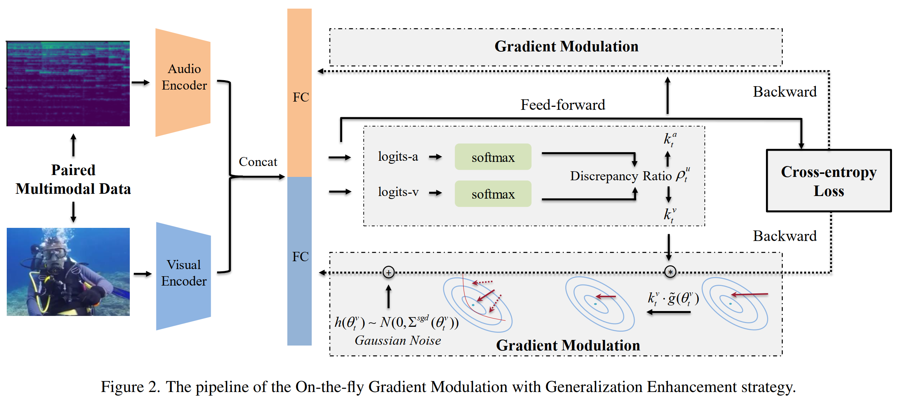
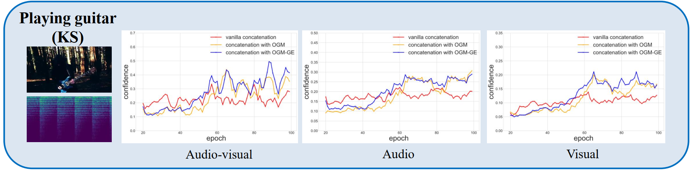
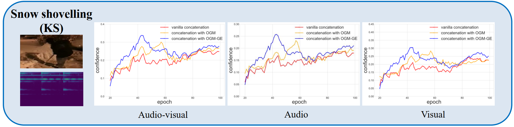

# Official OGM-GE in PyTorch


Here is the official PyTorch implementation of OGM-GE proposed in ''*Balanced Multimodal Learning via On-the-fly Gradient Modulation*'', which is a flexible plug-in module to enhance the optimization process of multimodal learning. Please refer to our [CVPR 2022 paper](https://arxiv.org/abs/2203.15332) for more details.

**Paper Title: "Balanced Multimodal Learning via On-the-fly Gradient Modulation"**

**Authors: Xiaokang Peng\*, [Yake Wei\*](https://echo0409.github.io/), [Andong Deng](https://dengandong.github.io/), [Dong Wang](https://redwang.github.io/) and [Di Hu](https://dtaoo.github.io/index.html)**

**Accepted by: IEEE Conference on Computer Vision and Pattern Recognition(CVPR 2022, Oral Presentation)**

**[[arXiv](https://arxiv.org/abs/2203.15332)]** **[[Supplementary Material](https://github.com/GeWu-Lab/OGM-GE_CVPR2022/blob/main/OGM_Sup.pdf)]** 


## News
The effectiveness of the OGM-GE method has been corroborated by the work of several other researchers.
| Task               | Dataset     |Modalities | w/o OGM-GE | w/ OGM-GE or similar | Source                                                                                                         |
|--------------------|--------------|--------------|------|------|------|
| Action Recognition | UCF101       |RGB, Optical-Flow | 82.3 | 84.0 | [1] |
| Knowledge Graph Link Prediction |  OpenBG-Complete-IMG+   |Image, OCR | 59.4 | 60.1 | [2] |

[1] [On Uni-modal Feature Learning In Supervised Multi-modal Learning](https://openreview.net/pdf?id=mb7VM83DkyC)

[2] [IMKGA-SM: Interpretable Multimodal Knowledge Graph Answer Prediction via Sequence Modeling](https://arxiv.org/pdf/2301.02445.pdf)


## What is the imbalance phenomenon in multimodal learning task?
We observe that **the potential of multimodal information is not fully exploited even when the multimodal model outperforms its uni-modal counterpart.** We conduct linear probing experiments to explore the quality of jointly trained encoders, and find them under-optimized (the yellow line) compared with the uni-modal model (the red line). We proposed the OGM-GE method to improve the optimization process adaptively and achieved consistent improvement (the blue line). We improve both the multimodal performance and uni-model representation as shown in the following figure.
<div  align="center">    

</div>

## Method Introduction
Pipeline of our OGM-GE method, consisting of two submodules:
1. On-the-fly Gradient Modulation (OGM), which is designed to adaptively balance the training between modalities;
2. Adaptive Gaussian noise Enhancement (GE), which restores the gradient intensity and brings generalization.
<div  align="center">    

</div>


## Main Dependencies
+ Ubuntu 16.04
+ CUDA Version: 11.1
+ PyTorch 1.8.1
+ torchvision 0.9.1
+ python 3.7.6


## Usage
### Data Preparation
Download Original Dataset：
[CREMA-D](https://github.com/CheyneyComputerScience/CREMA-D),
[AVE](https://sites.google.com/view/audiovisualresearch),
[VGGSound](https://www.robots.ox.ac.uk/~vgg/data/vggsound/),
[Kinetics-Sounds](https://github.com/cvdfoundation/kinetics-dataset).

[comment]: <> ([ESC50]&#40;https://github.com/karoldvl/ESC-50/archive/master.zip&#41;.)


### Pre-processing

For CREMA-D and VGGSound dataset, we provide code to pre-process videos into RGB frames and audio wav files in the directory ```data/```.

#### CREMA-D 

As the original CREMA-D dataset has provided the original audio and video files, we simply extract the video frames by running the code:

```python data/CREMAD/video_preprecessing.py```

Note that, the relevant path/dir should be changed according your own env.  

#### VGGSound

As the original VGGSound dataset only provide the raw video files, we have to extract the audio by running the code:

```python data/VGGSound/mp4_to_wav.py```

Then, extracting the video frames:

```python data/VGGSound/video_preprecessing.py```

Note that, the relevant path/dir should be changed according your own env. 


## Core code demo

Our proposed OGM-GE can work as a simple but useful plugin for some widely used multimodal fusion frameworks. We dispaly the core abstract code part as following:
```python
    ---in training step---
    
    # Out_a, out_v are calculated to estimate the performance of 'a' and 'v' modality.
    x, y, out = model(spec.unsqueeze(1).float(), image.float(), label, iteration)
    out_v = (torch.mm(x,torch.transpose(model.module.fc_.weight[:,:512],0,1)) + model.module.fc_.bias/2)
    out_a = (torch.mm(y,torch.transpose(model.module.fc_.weight[:,512:],0,1)) + model.module.fc_.bias/2)
    loss = criterion(out, label)

    # Calculate original gradient first
    loss.backward()
    
    # Calculation of discrepancy ration and k.
    k_a,k_v = calculate_coefficient(label, out_a, out_v)
    
    # Gradient Modulation begins before optimization, and with GE applied.
    update_model_with_OGM_GE(model, k_a, k_v)
    
    # Optimize the modulated parameters.
    optimizer.step()
    
    ---continue for next training step---
```

### default modulation setting: 

```--modulation OGM_GE --modulation_starts 0 --modulation_ends 50 --fusion_method concat --alpha 0.1```

You can train your model simply by running:

```python main.py --dataset VGGSound --train```.

You can also adapt to your own setting by adding additional arguments, for example, if you want to train our model on CREMA-D dataset, with gated fusion method and only OGM (i.e., without GE), and try to modulate the gradient from epoch 20 to epoch 80, you can run the following command: 

```train.py --train --dataset CREMAD  --fusion_method gated --modulation OGM --modulation_starts 20 --modulation_ends 80 --alpha 0.3```.


## Test and Eval

You can test the performance of trained model by simply running

```python main.py --ckpt_path /PATH-to-trained-ckpt ```

## Tips

There is a hype-parameter within OGM-GE, which is the alpha that depends on the modality discrepancy on different dataset. 
Here we recommend alpha=0.1 for VGGSound and alpha=0.8 for CREMA-D.

## Checkpoints

[CREMA-D](https://zenodo.org/record/6778788)


## Demo explanation
<div  align="center">    

</div>
<div  align="center">    

</div>
As shown in above picture, 'playing guitar' is a class that audio surpasses visual modality for most samples ('shovelling show' is just opposite), and we can tell audio achieves more adequate training and leads the optimization process. Our OGM-GE (as well as OGM) gains improvement in both modalties as well as multimodal performance, and the weak visual gains more porfit. The evaluation metric used in 'audio' and 'visual' is the predicted accuracy with classification scores just from one specific modality. 


## Citation
If you find this work useful, please consider citing it.

<pre><code>
@inproceedings{Peng2022Balanced,
  title	= {Balanced Multimodal Learning via On-the-fly Gradient Modulation},
  author = {Peng, Xiaokang and Wei, Yake and Deng, Andong and Wang, Dong and Hu, Di},
  booktitle	= {Proceedings of the IEEE/CVF Conference on Computer Vision and Pattern Recognition},
  year	= {2022}
}
</code></pre>

## Acknowledgement

This research was supported by Public Computing Cloud, Renmin University of China.

## License

This project is released under the [GNU General Public License v3.0](https://github.com/Mukosame/Zooming-Slow-Mo-CVPR-2020/blob/master/LICENSE).


## Contact us

If you have any detailed questions or suggestions, you can email us:
**yakewei@ruc.edu.cn** and **andongdeng69@gmail.com**
